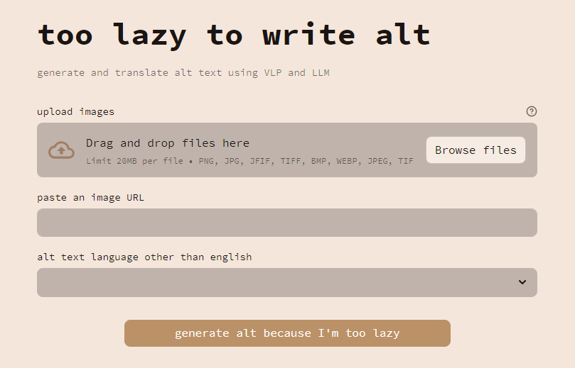
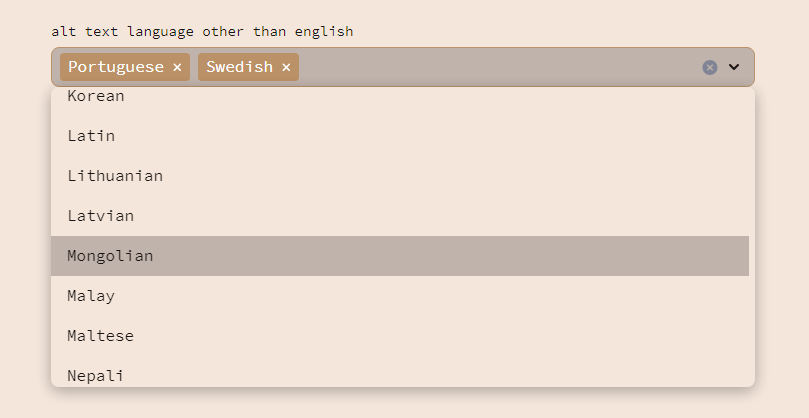
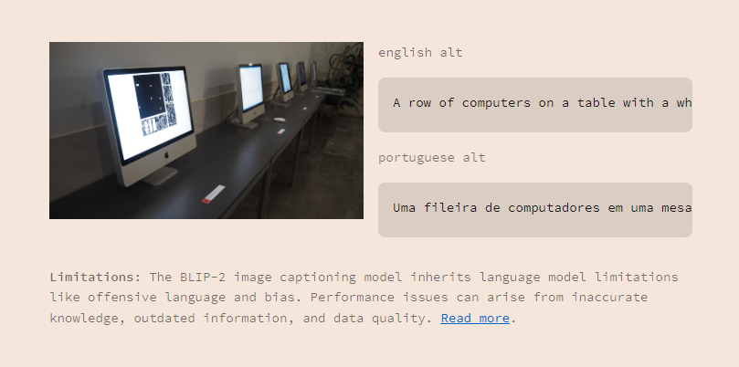

# 🦥 too lazy to write alt

Generate and translate alt text using VLP and LLM.

*too lazy...* is mobile-friendly, allows multiple images to be uploaded via URL or directly, offers translation into multiple languages, and includes a "copy to clipboard" button for each generated alt text.

## Language Model

BLIP-2* OPT 6.7B model is fine-tuned for the image captioning task using the ViT-g image encoder and the [OPT language model](https://arxiv.org/pdf/2205.01068.pdf) with 6.7 billion parameters. The model uses the prompt "a photo of" as an initial input to the language model and is trained to generate the caption with the language modeling loss.

*[BLIP-2](https://arxiv.org/pdf/2301.12597.pdf) is an innovative and resource-efficient approach to vision-language pre-training (VLP) that utilizes frozen pretrained image encoders and large language models (LLMs) (e.g. OPT, FlanT5).

### Limitations

The BLIP-2 image captioning model inherits the limitations and risks of language models, such as outputting offensive language, propagating social bias, or leaking private information. The model's performance could also be unsatisfactory due to various reasons, including inaccurate knowledge from the language model, activating the incorrect reasoning path, or not having up-to-date information about new image content. Additionally, the model's performance could be limited by the quality and diversity of the training data, as well as the generalization ability to unseen images and captions. Remediation approaches include using instructions to guide the model's generation, training on a filtered dataset with harmful content removed, or fine-tuning the model on a specific domain or task to improve its performance.

### Evaluation
BLIP-2 achieves state-of-the-art performance on various vision-language tasks while having a small amount of trainable parameters during pre-training, compared to other vision-language pre-training methods.

The model is fine-tuned for the image captioning task using the prompt "a photo of" as an initial input to the language model, and the model is trained to generate the caption with the language modeling loss.

## Specs

### Supported Formats

PNG, JPG, JFIF, TIFF, BMP, WEBP, JPEG, TIF

### Upload limits

- Up to 128 images
- Up to 20MB per file

## Screenshots

## Docs

- [Roadmap](docs/ROADMAP.md)
- [Changelog](docs/CHANGELOG.md)

## License

[GNU General Public License v3.0](LICENSE)
